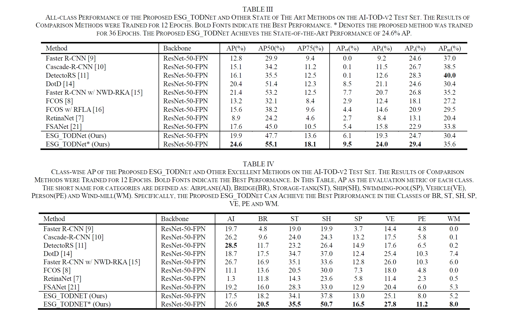

# <p align=center> A Tiny Object Detection Method Based on Explicit Semantic Guidance for Remote Sensing Images    (IEEE GRSL 2024) </p>

This repository contains python implementation of our paper [ESG_TODNet](https://ieeexplore.ieee.org/document/10462223).

### 1. Required environments:
* Linux
* Python 3.6+
* PyTorch 1.3+
* CUDA 9.2+
* GCC 5+
* [MMCV](https://mmcv.readthedocs.io/en/latest/#installation)
* [cocoapi-aitod](https://github.com/jwwangchn/cocoapi-aitod)


### 2. Install and start ESG_TODNet:

Note that our ESG_TODNet is based on the [MMDetection 2.24.1](https://github.com/open-mmlab/mmdetection). Assume that your environment has satisfied the above requirements, please follow the following steps for installation.

```shell script
git clone https://github.com/dyl96/ESG_TODNet.git
cd ESG_TODNet
pip install -r requirements/build.txt
python setup.py develop
```

Download [AI-TODv2](https://drive.google.com/drive/folders/1Er14atDO1cBraBD4DSFODZV1x7NHO_PY?usp=sharing) dataset

#### Get Started

```
python tools/train.py configs_esg/ESG_TODNet/aitodv2_fcos_r50_p2_esg_3x.py
```

### 3. Performance
<p align="center">
     <br />
</p>

### 4. Citation

Please cite our paper if you find the work useful:

    @ARTICLE{10462223,
      author={Liu, Dongyang and Zhang, Junping and Qi, Yunxiao and Wu, Yinhu and Zhang, Ye},
      journal={IEEE Geoscience and Remote Sensing Letters}, 
      title={A Tiny Object Detection Method Based on Explicit Semantic Guidance for Remote Sensing Images}, 
      year={2024},
      volume={},
      number={},
      pages={1-1},
      doi={10.1109/LGRS.2024.3374418}}

